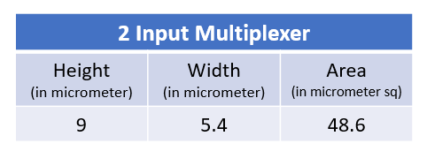
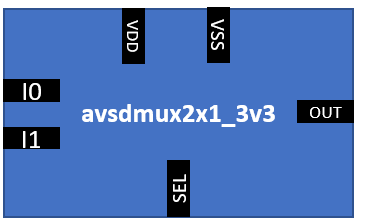
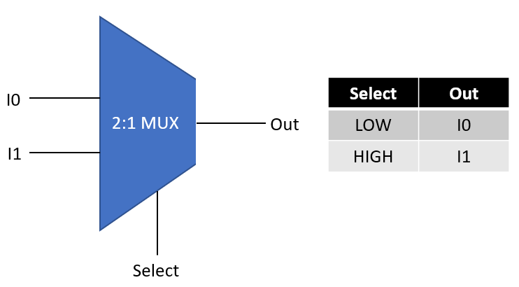
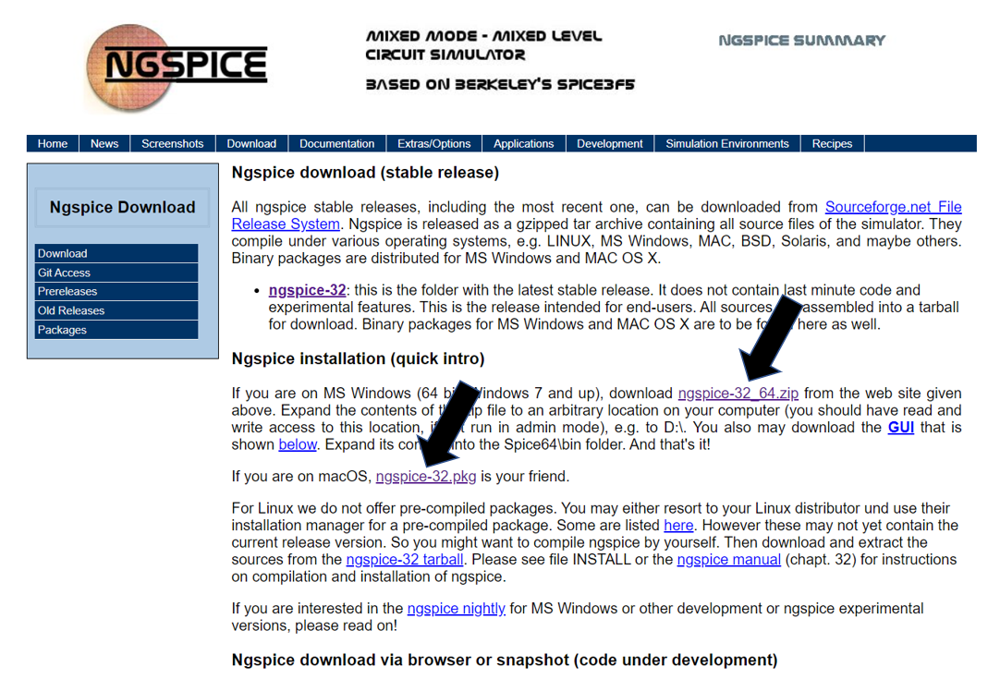
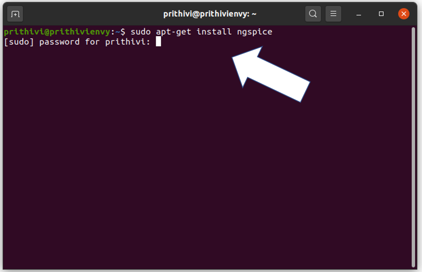
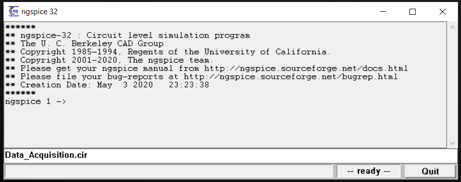
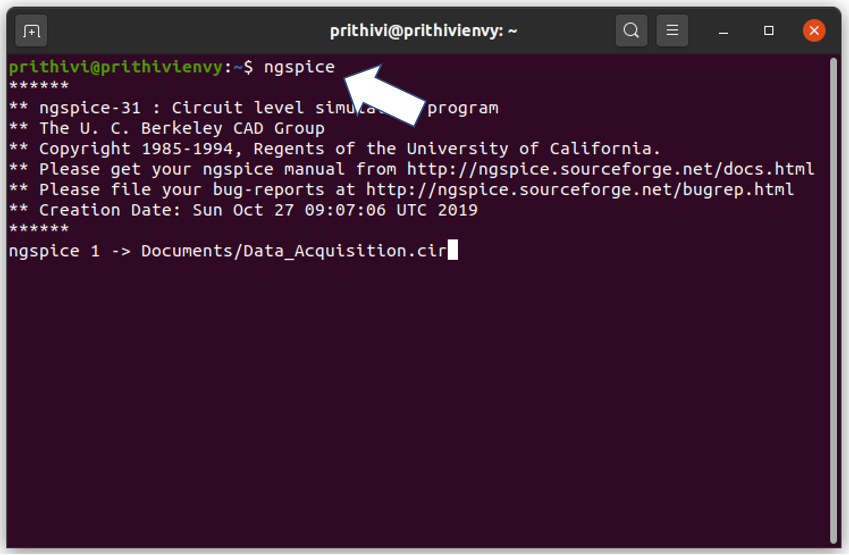
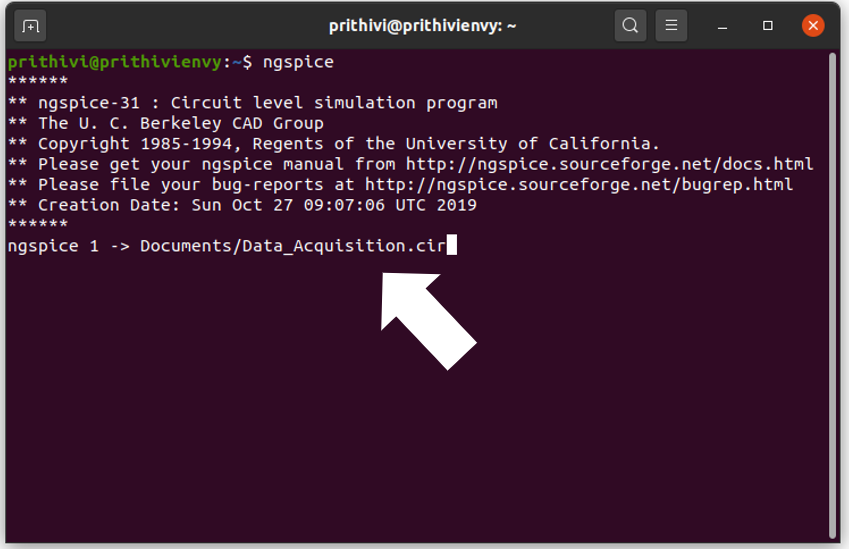
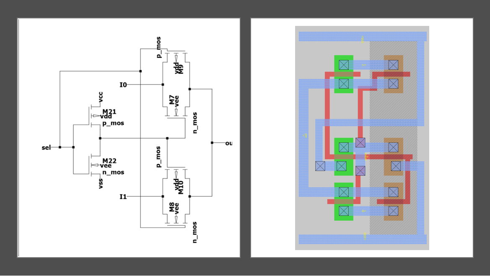
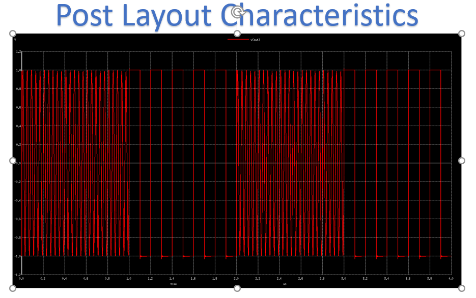

# avsdmux2x1_3v3
**avsdmux2x1_3v3** is a 2 input analog multiplexer. The entire  design is done with the help of OSU 180nm library.  
Transmission gates were used to design the analog multiplexer. The height, width and area of avsdmux2x1_3v3 is given below.



## Symbol and Pin Description
*In a 2 input analog multiplexer there is a total of 6 pins*
1. Two input pins. (I0 and I1)
2. One Select signal pins. (select)
3. Output pin. (Out)
4. Power pins (VDD and VSS)




## Forthcoming Work  
The design of analog multiplexer is done and its characteristics were verified till the post layout stage.  
As a next step in the future PnR (Place and Route) woks will be carried out and an entire chip design will  
be done. PnR will be done with the help of OpenROAD tools.

## IP Usage 
To view the IP characteristics and layout you have to install **NGSPICE and MAGIC VLSI Layout tool**. The  
setup and usage steps are mentioned below.

## NGSPICE
NGSPICE can be used to view the input output waveforms using spice netlist. NGSPICE is an open source mixed-signal circuit  
simulator. It is the result of combining existing SPICE features with some extra analyses, modeling  
methods and device simulation features.

## SETUP
**WINDOWS and Mac**  
1. NGSPICE zip file should be downloaded. The ZIP file can be downloaded from [Here](http://ngspice.sourceforge.net/download.html). 

   

2. Once downloaded extract the files in a folder of your convenience.
3. The netlist files should be saved inside the same folder, so choose your location accordingly.

**Ubuntu LINUX**
1. LINUX users, open the LINUX terminal and write the following command and press ENTER:  
   ```sudo apt-get install ngspice```
2. Type your Password and press ENTER.

   
   
3. NGSPICE will be installed in a couple of minutes.

## MAGIC VLSI Layout Tool
Magic is a venerable VLSI layout tool, written in the 1980's at Berkeley by John Ousterhout. It is  
largely used for academic purpose and also used by small companiies.

## SETUP
1. Clone the repositary using command ```git clone https://github.com/prithivjp/Analog-Multiplexer.git```
2. You can find a file **magic.sh** and a file **SCN6M_SUBM.10.tech** inside the folder MAGIC in the  
   repositary, copy both files to Home.
3. Open Terminal and run the following two commands:
      ```chmod +x magic.sh```
      ```./magic.sh```
4. MAGIC will be installed in a couple of minutes.
5. Since OSU 180nm technology is used you have to include the apprpriate tech file. Run the following command
      ```sudo cp SCN6M_SUBM.10.tech /usr/local/lib/magic/sys/```
      
 ## Viewing Characteristics using NGSPICE 
**WINDOWS and Mac**
1. After done with the extraction of the NGSPICE zip file, open the folder where you can see a folder named ```Spice64```.
2. Open the ```Spice64``` folder followed by another folder named ```bin```.
3. Copy the netlist files (.cir and .spice) and the library files(.lib) from the folder Netlists in the repositary and  
   save them inside bin folder mentioned above.
4. Open the ```ngspice``` applicaion in the bin folder and type the name of the .cir file saved in the previous  
   step along with the extension. Say for example if the file name is Data_Acquisition, type Data_Acquisition.cir in the box.
   
   
   
5. Press ENTER and respective waveforms appear.

**LINUX**
1. Copy the netlist files (.cir and .spice) and the library files(.lib) from the folder Netlists in the repositary to  
   some location. Also copy the library files to home also.
2. Open the LINUX terminal and write the command ```ngspice``` and press enter.

   
   
3. Type the path of the file saved in step 2 and and press enter. For example if the netlist files are  
   saved in Documents the command is ```Documents/Data_Acquisition.cir```.
   
   
   
4. Respective waveforms appear.

## Viewing Layout
1. After cloning the repositary copy the layout files (.mag) in the folder Layout to some location.
2. Right click on the new folder where the layout files are saved and click ```Open in terminal```.
3. Say, you want to open the layout of 21mux. Then type the following command and press enter  
   ```magic -T SCN6M_SUBM.10.tech 21mux.mag```
4. If you wish to view the spice file of the layout, open the tkcon window and enter the following  
   commands one by one:
         ```save```  
         ```ext```  
         ```ext2spice```
5. You can see the spice file in the same folder as that of your layout file.

    To run the post layout simulations, you have to add certain lines to the spice file extracted  
    such as library file include commands, voltage descriptions of input and power pins and simulation  
    commands such as **tran and control** commands. Such spice files are already made availabel in the 
    folder **NETLIST**.
   
## Pre Layout and Post Layout characteristics
The schematic and the layout of the 2 input analog multiplexer is given below:



## Characteristics
Two different inputs were given to the analog multiplexer model and the characteristics of pre and post layout  
were compared. Very slight glitches and some little variations were seen in the post layout characteristics.  
The respective spice files for pre layout and post layout is available in the folder **Netlist** in the repositary.  
Follow the steps mentioned in the **Viewing Characteristics** part of README.




For any dissimilarities found between the pre layout and postlayout characteristics or any difficulties with  
respect to IP Usage, contact the administrator or report in issues section of github.
    
## Contact Details
   **Prithivi Raj K  National Institute of Technology Tiruchirapalli prithivjp@gmail.com**  
   **Kunal Ghosh  Co-Founder at VLSI System Design(VSD) kunalpghosh@gmail.com**  
